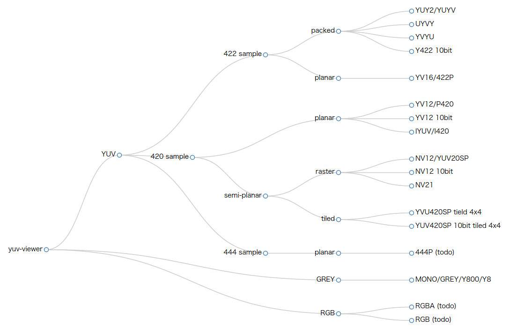

yvu-viewer
==========

Simple yuv-viewer with many features

[YUV](http://www.fourcc.org/yuv.php) have so many format.

Supports the following formats:

| dim         | range                       |
|-------------|-----------------------------|
| color space | YUV, RGB, Grey              |
| sample      | 444, 422, 420               |
| planar      | packed, semi-planar, planar |
| order       | YUV, YVU, ..                |
| bitdepth    | 8bit, 10bit, ..             |
| scan type   | raster, tiled               |

- YV12 / P420
- IYUV / I420
- YUY2 / YUYV
- UYVY
- YVYU
- YV12 10bit
- Y422 10bit
- YUV420SP / NV12
- NV21
- MONO / GREY / Y800 / Y8
- YV16 / 422P
- NV12 10bit
- YUV420SP Tiled mode
    - 4x4

Since SDL does not support 10 bit, I fake it
by converting it to standard 8bpp YV12 or 8bpp YVYU prior to viewing.

Basically, because that's whats SDL supports.
Other YCbCr (YUV) formats are simple to add as long as
they are 4:2:0 or 4:2:2 8-bpp...

Features
--------

- Smart guess option from filename
- **Interactive change width or height param on the fly**
    for quickly when guess param of yuv file
- Play, Pause, Rewind
- Single Step Forward, Backwards
- Zoom In/Out by a factor of 1..n
- Only display Luma/Cr/Cb component data
- Exchange Cr/Cb data
- Display a 16x16, 64x64, 256x256, 1024x1024 multiple-level grid on top of a frame
- Dump Macro-Block-data to stdout for MB pointed to by mouse
- Diff two files of the same size and format
- PSNR calculation
- Master/Slave mode that allows two instances of
  the binary to communicate using a message-queue.
  Commands issued in the Master are also executed
  in the Slave. Main usage is to single-step two clips
  side-by-side to compare them. Works regardless of
  format used
- Title reflects mode, feature used, including
  frame number and size.
- Histogram for the different color planes, per frame
  as csv-data to stdout (for now at least)

Build
-----

### Dependency
- [libsdl](http://www.libsdl.org/) 1.x version

#### Ubuntu:

    apt-get install libsdl1.2-dev

## Build

    make
    make install

Usage
-----

#### basic

    ./yv [FILENAME] [WIDTH] [HEIGHT] [FORMAT]
    ./yv foreman_cif.yuv 352 288 YV12

#### smart guess

    # smart guess from filename
    ./yv foreman_352x288_yv12.yuv

#### MASTER/SLAVE mode

To use MASTER/SLAVE, type the following
command in two different shells or send them to
the background using a `&` at the end:

    ./yv foreman_1.yuv 352 288 YV12
    ./yv foreman_2.yuv 352 288 YV12

In the first window, press F1 (title should be updated
to show the mode. In the second window, press F2
(title should be updated to show the mode).
Commands given in window1 should be executed in window2.

#### diff mode

To display diff between two files of the same size
and format, just add file as the last argument
(computes and displays differences in luma value only,
PSNR value is written to stdout):

    ./yv [FILENAME] [WIDTH] [HEIGHT] [FORMAT] [DIFF_FILE]
    ./yv foreman_cif.yuv 352 288 YV12 foreman_filtered_cif.yuv

Supported commands
------------------

    SPACE - Play clip (or pause)
    RIGHT - Single step 1 frame forward
    LEFT  - Single step 1 frame backward
    UP    - Zoom in
    DOWN  - Zoom out
    F5/y  - Toggle viewing of Luma(Y) data only
    F6/u  - Toggle viewing of Cb(U) data only
    F7/v  - Toggle viewing of Cr(V) data only
    F8/a  - Display (A)ll color-planes
    j     - increase height (vim key-binding style)
    k     - decrease height
    h     - decrease width
    l     - increase width
    r     - (R)ewind
    x     - E(X)change UV planar
    g     - Enable (G)rid-mode
    m     - Enable (M)B-mode, point and click to print MB-data to stdout
    s     - hi(S)togram, 1 per color plane
    q     - (Q)uit
    F1    - MASTER-mode
    F2    - SLAVE-mode
    F3    - NONE-mode, i.e. disable MASTER/SLAVE-mode

Disclaimer
----------

Only verified on a Linux based system...

### How to use it at Windows
It only support run linux natively now.

However, we could run linux remote GUI program by X11 forwarding. This depend
on other tools.

* SSH client which support X11 forwarding, such as, SercureCRT, putty, XShell and so on.
* X server at Windows, such as, [Xming](https://sourceforge.net/projects/xming/).

### Steps
- lunch Xming at background.
- ssh to server by SecureCRT.
- directoy run `yv [filename]` at server.
- window pop out at local Windows PC.

Notice, this GUI program run at linux remote server, by forwarding to local PC
by SSH. So it's **SLOW**. Viewing 2K yuv at LAN environment, it works.
Viewing 4K yuv at LAN, it lags.

TODO List
---------

- [X] guess argument in filename
- [X] yuv420sp
- [X] 10bit
- [X] Tile mode
- [X] swap Cb/Cr
- [X] increase stride
- [ ] RGB/RGBA support
- [ ] 444p format
- [ ] Windows support
    Not support linux, it's too inconvenient. As libsdl support Windows, I plan
    to support it too.
- [ ] show difference of yuv under diff mode
- [X] Tiled 10bit
